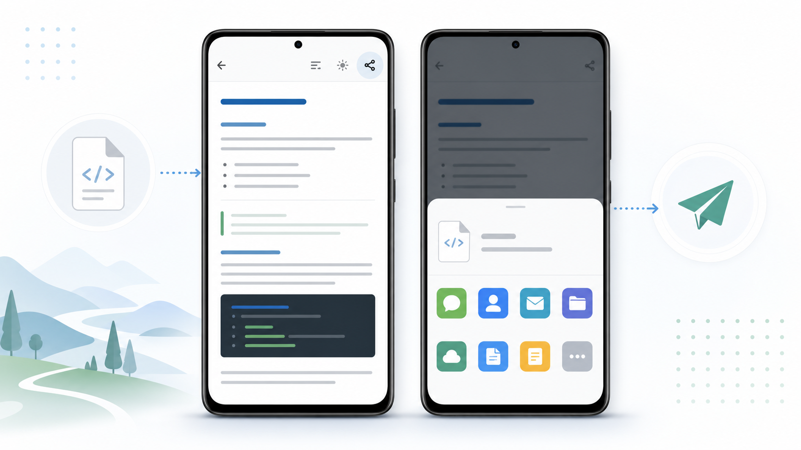

# MD阅读器

一款为 AI 时代准备的轻量级手机 Markdown 阅读器。Android / 支持 APK 安装的鸿蒙设备已更新到 v1.4.1，iOS v1.3 源码已加入并完成模拟器构建 / 安装 / 启动冒烟测试。

[](https://github.com/mizzlelover/ai-md-reader-android/releases/latest)
[](https://github.com/mizzlelover/ai-md-reader-android/actions/workflows/android-ci.yml)
[](LICENSE)



现在越来越多内容从 AI 对话、代码助手、知识库、会议纪要和自动化工作流里直接产出为 Markdown。电脑上阅读很方便，但手机上常常缺一个足够轻、足够直接、能从微信和文件管理器顺手打开 `.md` 的本地阅读器。**MD阅读器**解决的就是这个小而高频的痛点：把 Markdown 文件在手机上安静、清楚、离线地读起来。

项目由 **谁是专家** 发起并完全开源，目标是在保持轻量级的前提下，逐步补齐 AI 辅助编码与 AI 内容消费中的高频场景。

## 最新版本 v1.4.1

v1.4.1 重点打磨“长文读到一半，下次接着读”的连续性，也修复了收藏文档在历史记录里的状态误判：

- **记住上次阅读位置**：再次打开同一文档时自动回到上次阅读处，适合 AI 生成的长方案、长纪要和代码说明。
- **重排后仍能大致对位**：按滚动比例记忆阅读位置，调整字号、行距、段距后仍能回到接近的位置。
- **收藏历史更可靠**：已收藏文档在“打开历史”中直接使用本地副本，不再误报“授权过期”；取消收藏后才回到原来源读取。
- **保留 v1.4 一键转发**：继续支持把完整 `.md` / `.markdown` 文件交给系统分享面板，转发到微信、QQ、邮件、文件应用等。
- **Android / 鸿蒙兼容设备更新**：本次 v1.4.1 为 Android APK 侧更新；支持 APK 安装的鸿蒙设备可按同样方式试用。iOS 仍停留在 v1.3 源码。

[下载 Android v1.4.1 APK](https://github.com/mizzlelover/ai-md-reader-android/releases/download/v1.4.1/MDReader-1.4.1.apk) · [查看 v1.4.1 Release](https://github.com/mizzlelover/ai-md-reader-android/releases/tag/v1.4.1) · iOS 版目前提供源码，TestFlight 待 Apple Developer 签名账号接入。

## 平台状态

| 平台 | 当前状态 |
| --- | --- |
| Android | v1.4.1 已发布 APK，可在 GitHub Releases 下载 |
| 鸿蒙 | 支持 APK 安装的设备可按 Android APK 方式侧载试用，实际可用性取决于系统版本和安装策略 |
| iOS | v1.3 源码位于 `ios/`，已通过模拟器构建 / 安装 / 启动 / 主题冒烟；TestFlight 需要配置 Apple Developer Team ID 后归档上传 |

## 核心定位

- **轻量优先**：不做臃肿编辑器，先把“打开、阅读、跳转、排版”做好。
- **本地优先**：Markdown 渲染资源打包在 APK 内，常规阅读无需联网。
- **移动优先**：适配手机上的文件打开链路，尤其是微信、文件管理器、聊天软件里的 `.md` 文件。
- **AI 场景优先**：面向 AI 生成文档、代码说明、知识库片段、长提示词、会议纪要等高频 Markdown 内容。

## 功能特性

| 场景 | 能力 |
| --- | --- |
| 打开本地 Markdown | 通过系统文件选择器读取 `.md` / `.markdown` 文件，免存储权限；仅允许选择 Markdown 文件，选择其他类型会友好提示 |
| 从其他应用打开 | 支持微信、文件管理器、QQ、邮件等应用的“用其他应用打开”入口 |
| 源码 / 预览切换 | 同一文件可在原始 Markdown 与渲染预览之间切换 |
| 代码块复制 | 预览模式下每个代码块右上角提供一键复制 |
| 阅读排版调节 | 点击屏幕中央区域调出，支持字号、行间距、段间距实时调节，并自动记忆 |
| 阅读位置记忆 | 再次打开同一文档时自动回到上次阅读处，按滚动比例保存，调整排版后仍能大致对位（Android / 鸿蒙兼容设备 v1.4.1） |
| 明暗主题 | 支持跟随系统、浅色、深色 |
| 文档目录 | 自动生成标题目录，点击后平滑跳转 |
| 标题折叠 | 预览模式下点击标题即可折叠或展开对应章节 |
| 打开历史 | 记录最近打开文件，并区分“授权过期”（如微信临时授权失效）与“已删除”（文件被物理删除）；已收藏文档直接使用本地副本 |
| 收藏夹 | 收藏会把文档复制到应用目录，原文件被删除或授权过期后仍可打开；同一文件不重复复制，取消收藏会同步删除副本 |
| 转发分享 | 阅读时一键把完整 `.md` 文档经系统分享转发到微信等应用（如微信好友），对方收到可再次打开的 `.md` 文件（Android / 鸿蒙兼容设备 v1.4） |
| 离线渲染 | 内置 markdown-it 与 highlight.js，支持常见 Markdown 语法和代码高亮 |

支持标题、列表、引用、表格、围栏代码块、行内代码、分隔线、图片等常见语法。出于安全考虑，预览默认不渲染 Markdown 中内嵌的原始 HTML。

## 下载安装

Android 发布版 APK 会放在 GitHub Releases 中。下载最新版本后，在 Android 手机上允许“安装未知来源应用”即可侧载安装。支持 APK 安装的鸿蒙设备可按同样方式试用。

也可以通过 ADB 安装本地构建产物：

```bash
adb install -r app/build/outputs/apk/release/app-release.apk
```

iOS 版暂未提供公开 TestFlight / IPA 安装包；当前先开放源码，待 Apple Developer 账号、Team ID 和签名配置完成后再进入 TestFlight。

说明：仓库不跟踪 APK、AAB、IPA、archive、keystore 等二进制发布物和签名材料。源码归源码，安装包通过 Releases 或 TestFlight 分发。

## 版本更新

| 版本 | 类型 | 更新重点 |
| --- | --- | --- |
| [v1.4.1](https://github.com/mizzlelover/ai-md-reader-android/releases/tag/v1.4.1) | 最新版本 | 新增阅读位置记忆；修复已收藏文档在打开历史中误报“授权过期”的问题；本次为 Android / 鸿蒙兼容设备更新 |
| [v1.4](https://github.com/mizzlelover/ai-md-reader-android/releases/tag/v1.4) | 历史记录 | 新增「转发」：阅读时一键把完整 `.md` 文档经系统分享转发到微信等应用（如微信好友）；本次为 Android / 鸿蒙兼容设备更新 |
| [v1.3](https://github.com/mizzlelover/ai-md-reader-android/releases/tag/v1.3) | 历史记录 | 收藏 / 取消收藏移至工具栏常显；工具栏调整为目录、源码 / 预览、收藏、更多菜单；显示设置改为点击屏幕中央唤出；标题折叠箭头改为内联并使用主题色；新增 iOS v1.3 源码并完成模拟器冒烟 |
| [v1.2](https://github.com/mizzlelover/ai-md-reader-android/releases/tag/v1.2) | 历史记录 | 预览代码块新增一键复制；打开文件时仅允许 `.md` / `.markdown`；打开历史区分“授权过期”和“已删除”；新增收藏夹，收藏后复制到应用私有目录 |
| [v1.1](https://github.com/mizzlelover/ai-md-reader-android/releases/tag/v1.1) | 首个 GitHub 开源发布版 | 新增文档目录、标题折叠 / 展开、打开历史；保留源码 / 预览切换、字号 / 行距 / 段距、明暗主题等基础阅读能力 |
| [v1.0](https://github.com/mizzlelover/ai-md-reader-android/releases/tag/v1.0) | 历史记录 | 首个可安装版本；支持本地 Markdown 打开、源码 / 预览切换、从微信等应用“用其他应用打开”、基础排版调节和主题切换 |

完整版本记录见 [CHANGELOG.md](CHANGELOG.md)，每版详细说明见 [GitHub Releases](https://github.com/mizzlelover/ai-md-reader-android/releases)。

## 使用方式

1. 工具栏常显五项：转发、目录、源码 / 预览切换、收藏切换、更多菜单（⋮）。
2. 从“更多菜单 ⋮ → 打开”用系统文件选择器选择 Markdown 文件（仅 `.md` / `.markdown`）。
3. 点击“目录”，从左侧目录快速跳转到标题位置。
4. 在预览模式下点击标题，可折叠或展开该章节内容；代码块右上角可一键复制。
5. 点击屏幕中央区域，调出“显示设置”（字号、行间距、段间距、主题）。
6. 点击工具栏星形图标“收藏”当前文档；在“更多菜单 ⋮ → 收藏夹 / 打开历史”中管理。
7. 点击工具栏“转发”，把当前完整 Markdown 文件交给系统分享面板，再选择微信等应用发送。
8. 下次重新打开同一文档时，会自动回到上次阅读位置。
9. 在微信收到 `.md` 文件时，选择“用其他应用打开”，再选择“MD阅读器”。

关于微信打开方式：`.md` 没有统一标准 MIME 类型，微信等应用常把它标记为 `application/octet-stream` 或 `text/plain`。为了可靠接住这些文件，本应用登记了较宽泛的打开类型，因此也可能出现在部分纯文本或未知类型文件的打开列表中。

## 从源码构建 Android

环境要求：

- Android SDK：compileSdk 34，minSdk 26
- JDK：17 或 21
- Gradle：使用仓库自带 `./gradlew`

构建命令：

```bash
# 调试包
./gradlew :app:assembleDebug

# 发布包
./gradlew :app:assembleRelease
```

如果本地存在 `keystore/keystore.properties`，构建脚本会使用其中配置进行 release 签名；如果不存在，会回退到 debug 签名，仍可生成可安装 APK。正式分发时请使用你自己的 keystore，不要提交任何签名材料。

## 从源码构建 iOS

iOS 工程使用 XcodeGen 生成，源码位于 `ios/`：

```bash
cd ios
xcodegen generate

DEVELOPER_DIR=/Applications/Xcode.app/Contents/Developer \
xcodebuild -project MDReader.xcodeproj -scheme MDReader \
  -sdk iphonesimulator -destination 'platform=iOS Simulator,name=iPhone 17,OS=26.4' \
  CODE_SIGNING_ALLOWED=NO build
```

TestFlight / 真机发布前，需要在 `ios/project.yml` 中配置自己的 `DEVELOPMENT_TEAM` 和可用的 Bundle ID，然后用 Xcode 归档上传。签名证书、Team ID、API Key 等敏感信息不要提交到仓库。

## 技术栈

- Kotlin + 原生 Android
- SwiftUI + WKWebView（iOS）
- AndroidX Core / AppCompat / WebKit
- Material Components
- WebView + WebViewAssetLoader
- markdown-it 14.1.0
- highlight.js 11.9.0

项目结构：

```text
.
├─ app/
│  ├─ build.gradle.kts
│  └─ src/main/
│     ├─ AndroidManifest.xml
│     ├─ java/com/mdreader/app/
│     ├─ res/
│     └─ assets/
├─ ios/
│  ├─ project.yml
│  └─ MDReader/
│     ├─ App/
│     ├─ Model/
│     ├─ Views/
│     └─ Resources/
├─ gradle/
├─ build.gradle.kts
├─ settings.gradle.kts
├─ CHANGELOG.md
├─ CONTRIBUTING.md
├─ LICENSE
└─ THIRD_PARTY_NOTICES.md
```

## 路线图

项目会优先围绕“手机上高频阅读 AI 生成 Markdown”演进：

- 文内搜索与高亮定位
- 最近文件分组与收藏
- 更好的长文阅读体验
- Mermaid、任务列表、脚注等增强语法支持
- Markdown 分享预览与导出
- 更清晰的代码块复制体验
- 更小的包体与更稳定的离线资源策略

完整维护计划见 [docs/ROADMAP.md](docs/ROADMAP.md)。

## 开源协议

本项目使用 [MIT License](LICENSE) 开源。第三方依赖声明见 [THIRD_PARTY_NOTICES.md](THIRD_PARTY_NOTICES.md)。

欢迎提交 issue、PR 和真实使用场景。**谁是专家** 会把这个项目尽量维护得朴素、轻巧、可持续。
